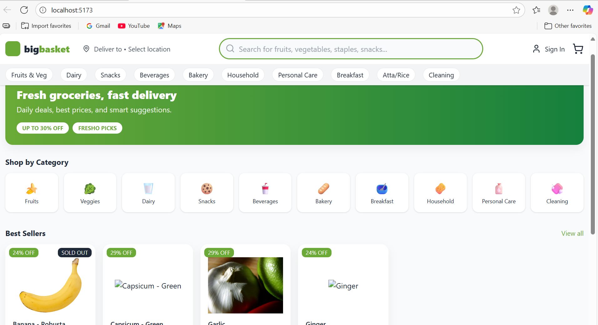
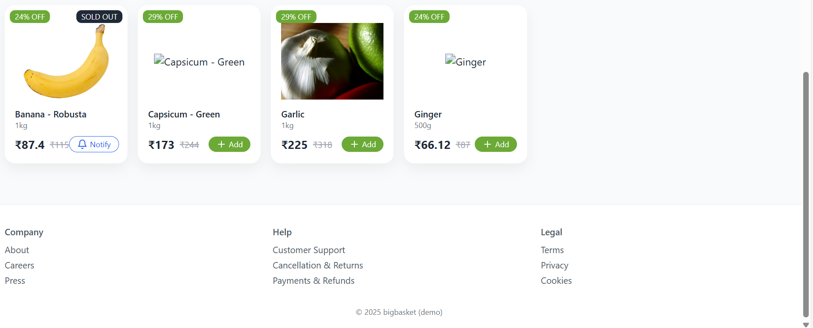

---

# 🛒 BigBasket Smart Cart – Hackathon Prototype 🚀

> An **AI-powered grocery shopping assistant** that solves real-world e-grocery problems like incomplete carts, poor recommendations, stock issues, and delayed refunds.
> Built for **InnoVateX 2025 Hackathon** ✨

---

## 📌 Problem Statement

Current online grocery apps (like BigBasket) face challenges:

* ❌ Users forget essentials → **incomplete carts → multiple orders**
* ❌ Items marked available later turn **out of stock**
* ❌ **Poor recommendations** (irrelevant items shown)
* ❌ **Delayed refunds** for missing/undelivered products
* ❌ Cart often **clears on logout / session timeout**
* ❌ **Complicated returns** for perishable goods

---

## 💡 Our Solution – Smart Cart Features

✅ **Smart Auto-Cart** – Auto-fills missing essentials (milk, oil, rice, salt) from past history
✅ **Recipe-to-Cart** – Type a dish (“Paneer Butter Masala”) → AI adds ingredients
✅ **Cart Guard** – Cloud-synced cart, never lost on logout
✅ **Smart Related Items** – Contextual suggestions (Banana → Peanut Butter, Oats)
✅ **Stock Checker** – Warns if items are unavailable before checkout
✅ **Instant Refunds** – < 1 min auto-refund demo flow
✅ **Notify Me** – Alerts when out-of-stock items are back

---

## ⚡ Tech Stack

### 🔹 Frontend

* React + Vite ⚛️
* TailwindCSS + Shadcn/UI 🎨
* Lucide Icons

### 🔹 Backend

* Flask (Python) 🐍
* Flask-CORS for API
* JSON mock data for products

### 🔹 Smart Features (AI/ML Ready)

* Personalized cart suggestions
* Recipe → Ingredients mapping
* Stock checker + Instant refunds

---

## 🛠️ Setup Instructions

### 1️⃣ Clone repo

```bash
git clone https://github.com/jashveer-sharma/bigbasket-smart-cart.git
cd bigbasket-smart-cart
```

### 2️⃣ Backend (Flask API)

```bash
cd backend
pip install -r requirements.txt
python app.py
```

Runs on → `http://127.0.0.1:5000`

### 3️⃣ Frontend (React + Vite)

```bash
cd frontend
npm install
npm run dev
```

Runs on → `http://localhost:5173`

---

## 📸 Screenshots / Progress Demo

> 🔧 Prototype is **work in progress** — full version will be submitted by **18th Aug 2025, 12 PM**.

### 🏠 Home Page (Progress 1)



### 🏠 Home Page (Progress 2)



---

## 🎯 Future Scope

* 🤖 **AI-powered demand forecasting** for inventory
* 👀 **Computer Vision** for fresh produce quality checks
* 🔗 **Tata Neu Wallet Integration** (loyalty points & offers)
* 🔒 **Blockchain Refunds** for 100% transparent returns
* 📦 **IoT Smart Warehouses** with real-time stock sync

---

## 👨‍💻 Team

Built with ❤️ by **Team Synapse** @ InnoVateX 2025

---

⭐ If you like this project, give it a **star** on GitHub!

---

